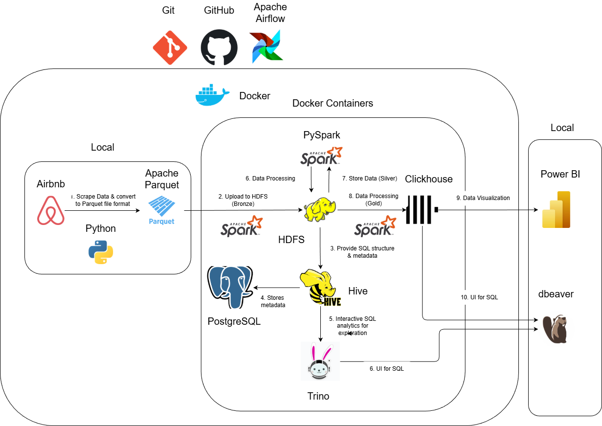

# 3. Tools and Technologies

Several tools and technologies were used inside the project for various purposes; including pipeline orchestration, data processing, data ingestion, version control. The listed tools and how they are integrated within a dataflow diagram can be found under [Appendix 3.1](appendix-3.1). 

In any projects, it is vital for code to be version-controlled while enabling cross collaboration. Hence, we decided to use a Docker environment alongside GitHub for team members to contribute their codes, and merging everyone's contributions after a thorough validation by other teammates. 

Docker provides an lightweight environment by setting configurations inside a docker-compose.yml file. By pulling the right Docker images from the vast repository of official//user-contributed images developed and saved within Docker Hub, users can create containers from the images, link the containers together using Docker networks and mounted volumes for shared data. Referring to the dataflow diagram, Docker is responsible for setting up many services, including Apache Airflow, Apache Spark (PySpark), HDFS, Hive, Trino, PostgreSQL, Clickhouse which are all linked to each other. 

Git and GitHub combo allows neat version control done via simple Git commands. Once users added abew feature, or fix some issues, they can contribute to the shared GitHub repository found under [Appendix 3.2](appendix-3.2) by submitting a new branch. Once other users validated the code for testing purposes and approved it, GitHub allows for merging branches via clicking a few buttons. This simple branch-like structure within Git allows all users to stay up-to-date with the latest codebase by running **git pull**, while contributing their own branches that would not affect the main codebase by running **git push**.

Next, we decided to webscrap the data within Inside Airbnb using Python's built-in requests alongside BeautifulSoup for HTML parsing to look for the correct CSV's files to download. To integrate within Airflow for pipeline orchestration, we decided to create a Docker image using Dockerfile by pulling a Python image and installing necessary packages (such as **pandas**, **BeautifulSoup**) using a lightweight package manager, **uv**. The webscrapper will look inside the Inside Airbnb website and look for files that contain the "listings.csv.gz" keyword under selected towns (London, Bristol, Edinburgh) as parameters. After downloading the CSV's files, the webscrapper will also standardize the inconsistent schemas such as STRING and DOUBLE for same columns in different files. Finally, the webscrapper converts the datasets into parquet format for lightweight storage and integration with HDFS. The parquet files are stored locally partitioned by the extraction date and city, and mounted inside the Docker environment as can be found under [Appendix 3.3](appendix-3.3).

Following the ingestion of raw data, the data will be uploaded inside HDFS via Apache Spark. This part is known as the bronze layer where raw data is ingested into our data architecture. The data is later cleaned inside the silver layer using Apache Spark for deduplication, column formatting//cleaning, and removing rows that do not contain price values. Finally, the data is processed according to a **Star Schema** where we created two (2) dimension tables, hosts and listings and one (1) fact table, listings; this step is also known as the gold layer. The processed data are finally stored inside Apache Clickhouse, an OLAP columnar database that stores the data of each column independetly. Due to the nature of OLAP database, Clickhouse enables more efficient aggregation queries, and faster filtering due to Clickhouse's built-in MergeTree engine.  

In the meantime, the raw data and staging data inside Bronze and Silver layers respectively can be explored via familiar SQL queries. We decided to integrate Hive to create external tables reading the parquet files inside HDFS and storing the metadata within a PostgreSQL database. Users can explore and troubleshoot the data, should there be issues found within the downstream data using Trino, which is connected to Hive but offers faster, and interactive analytics by bypassing MapReduce for lower-latency queries. Both Clickhouse and Trino SQL queries can be executed within the terminal by using Docker to connect to the individual containers; but we decided to expose both Clickhouse's and Trino's ports to local PC, and using a popular database management tool that serves a SQL client and IDE to manage queries, that offers a simplistic UI for data browsing, SQL editing, known as dbeaver that is installed from the native Microsoft Store (for Windows user). 

The processed data is visualized using Microsoft's Power BI (similarly installed from Microsoft Store), Power BI can be integrated with multiple data storages, including but not limited to Clickhouse, Trino, MySQL, S3 Object Storage by installing the necessary drivers. Furthermore, Power BI offers a drag-and-drop user-friendly UI that can be used to create interactive, cross-filtering dashboards. In this project, Power BI is used to connect to the processed data inside Clickhouse and visualizes key metrics such as **average review ratings**, **number of verified hosts**, **number of listings from London, Edinburgh, Bristol**. The snapshot of the Power BI dashboard can be found under [Appendix 3.4](appendix-3.4).

Last but not least, the ELT pipeline can be orchestrated and ran with a single button-click thanks to Apache Airflow. A DAG, or Directed Acyclic Graph is set-up within Airflow to represent the tasks from raw data ingestion via webscrapping to uploading the data within HDFS to processing and finally loading the data into Clickhouse. Airflow also enables scheduling, such as rerunning the entire pipeline every fixed hours, or days, vital for automation of data pipeline in the real world. 

# 5. Conclusion

This concludes the Airbnb ELT project from raw data ingestion to data visualization and analysis. 

For future work, many tools can be further integrated within the pipeline to enable a smoother, more efficient ELT projects. For example, as data size grows, storing the data locally is not a feasible option, and hence should be stored inside a **Cloud Object Storage**, such as S3 offered by AWS, and Google Cloud Storage (GCS) offered by Google Cloud Platform (GCP) whereas Spark will just directly read from the Cloud.

Furthermore, referring to the **Variety** of 7V's of Big Data, Airbnb data contains multiple types of unstructured data, such as user reviews and listing photos. Hence, the project can be further upgraded to support unstructured data using tools such as a NoSQL database, object storage for a data lake or lakehouse approach using Apache Iceberg. As the volume of data inevitably increase, Cloud options should be comprehensively explored for a more resource optimized and cost savings approach, such as using services offered by AWS (Glue, S3, Lambda) for a more robust pipeline that offers high fault tolerance and availability via distribution of computing resources across multiple regions on the planet.

# Appendix

## 3. Tools and Technologies

### Appendix-3.1

